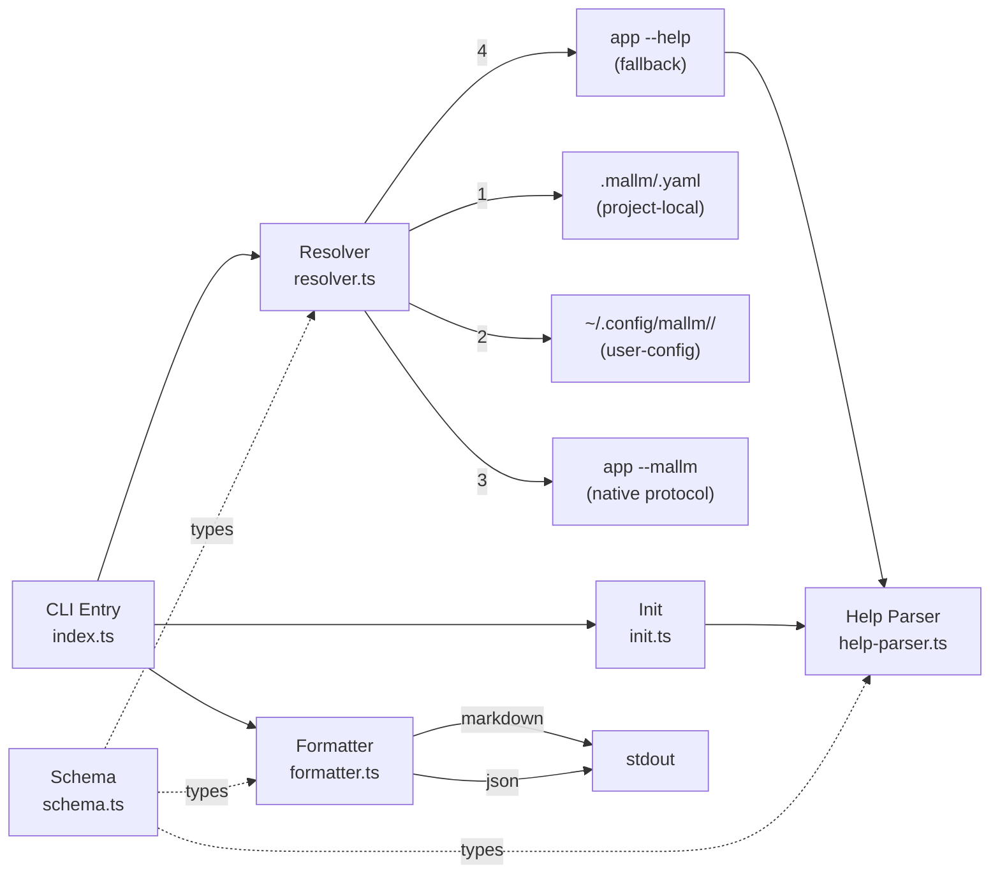

# Project Architecture

## Overview

`mallm` is a CLI tool that provides structured, LLM-friendly documentation for command-line tools. It resolves documentation from multiple sources via a priority chain, formats it for human or machine consumption, and can bootstrap documentation stubs by parsing `--help` output.

The codebase is a single-process Node.js CLI (~630 lines of TypeScript) with no runtime services, no persistence layer, and no network calls beyond shelling out to target tools.

## System Diagram

## Core Components

| Component | File | Purpose |
|-----------|------|---------|
| CLI | `src/index.ts` | Commander-based entry point; commands: `show`, `init`, `list`, `validate`, `schema` |
| Resolver | `src/resolver.ts` | 4-tier resolution chain returning the first match |
| Formatter | `src/formatter.ts` | Renders `MallmConfig` as markdown (section-aware) or JSON (with `_meta`) |
| Help Parser | `src/help-parser.ts` | Extracts summary, arguments, and subcommands from `--help` text |
| Init | `src/init.ts` | Scaffolds `mallm.yaml` stubs; seeds from `--help` when available |
| Schema | `src/schema.ts` | TypeScript interfaces (`MallmConfig`, `ResolvedMallm`, `MallmArgument`) |
| JSON Schema | `schemas/mallm.schema.json` | Canonical schema for `mallm.yaml` validation |

## Resolution Chain

The resolver (`resolve_mallm`) tries four sources in order, returning the first hit:

1. **Project-local** — `.mallm/<app>.yaml` in the nearest git root or `.mallm/` ancestor
2. **User config** — `~/.config/mallm/<app>/mallm.yaml` (supports `<version>/mallm.yaml` and `latest/`)
3. **Native protocol** — executes `<app> --mallm`, expects YAML on stdout
4. **Help fallback** — parses `<app> --help` output into a basic `MallmConfig` via `help-parser.ts`

Each result carries a `source` tag (`project-local`, `user-config`, `native`, `help-generated`) and optional `path`, which the formatter includes as provenance metadata.

## Data Model

`MallmConfig` is the central type. Key sections:

| Section | Content |
|---------|---------|
| `summary` / `description` | Human-readable identity |
| `usage.examples` | Concrete command + description + optional output |
| `arguments` | Typed args: `flag`, `option`, `positional`, `variadic` |
| `subcommands` | Nested commands with own args and examples |
| `environment` | Required/optional env vars |
| `context` | LLM guidance: `when_to_use`, `when_not_to_use`, `common_patterns`, `gotchas` |
| `output` | stdout/stderr semantics, exit codes, format list |
| `skills` / `related` | Cross-references to extended docs and related commands |

## Key Decisions

- **YAML over JSON for authoring** — humans write `mallm.yaml`; JSON is output-only (`--json`). YAML's multiline strings suit the prose-heavy `context` section.
- **Resolution chain over registry** — no central database; discovery is file-system and exec-based, so definitions travel with projects.
- **Help fallback as degraded mode** — any tool with `--help` gets basic mallm coverage without authoring effort; regex-based extraction handles common flag/subcommand patterns.
- **No caching** — resolution is fast (stat calls + one optional exec); adding a cache would complicate invalidation for negligible benefit.

## Technology Stack

| Layer | Choice |
|-------|--------|
| Runtime | Node.js ≥20 (ESM) |
| Language | TypeScript 5.8 |
| CLI framework | Commander 13 |
| YAML | `yaml` 2.7 |
| Terminal styling | Chalk 5 |
| Build | `tsc` (no bundler) |
