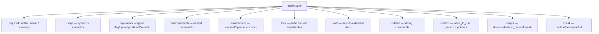

# Project Schema — mallm

> **No persistence layer.** mallm has no database, no SQL schema, and no Liquibase
> changelogs. It is a stateless TypeScript CLI (v0.1.0) that reads YAML documentation
> files and emits Markdown/JSON. This document therefore covers the artifacts it
> *does* define: the `mallm.yaml` file format, its JSON Schema, config lookup paths,
> and the CLI flag grammar.

## mallm.yaml — the mallm file format

Canonical definition: `schemas/mallm.schema.json` (JSON Schema draft 2020-12,
`$id https://mallm.dev/schemas/mallm.schema.json`). Also printable via `mallm schema`.

Top-level structure:



### Section reference

| Section | Type | Required | Contents |
|---------|------|----------|----------|
| `mallm` | string | Yes | Schema version; only `"1.0"` currently |
| `name` | string | Yes | Command name |
| `summary` | string | Yes | One-line description |
| `version` | string | No | Tool version |
| `description` | string | No | Multi-line detail |
| `usage` | object | No | `synopsis` (string); `examples[]` each `{command, description, output?}` |
| `arguments[]` | array | No | Each `{name, type, description}` required; optional `required`, `default`, `value` (option placeholder), `choices[]` |
| `subcommands[]` | array | No | Each `{name, summary}` required; optional `description`, `arguments` (same shape), `examples` (same shape) |
| `environment[]` | array | No | Each `{name, description}` required; optional `required`, `default` |
| `files[]` | array | No | Each `{path, description}` |
| `skills[]` | array | No | Each `{name, description}` required; optional `path`, `url` — links to extended docs/skill defs |
| `related[]` | array | No | Each `{name, description}` |
| `context` | object | No | LLM guidance: `when_to_use`, `when_not_to_use` (strings); `common_patterns[]` each `{name, steps[], description?}`; `gotchas[]` (strings) |
| `output` | object | No | `stdout`, `stderr` (strings); `exit_codes` (string→string map); `formats[]` (strings) |
| `install` | object | No | `method`, `command`, `url` |

`argument.type` is an enum: `flag` · `option` · `positional` · `variadic`.

**Validation**: `mallm validate <path>` performs structural checks (required top-level
fields; per-argument `name`/`type`/`description`) — it does not run the JSON Schema
itself. The schema file is the authoritative contract.

### Runtime-added fields (JSON output)

`mallm show <app> --json` appends a `_meta` object (`source`, timestamp) on top of the
parsed config; it is not part of the schema.

## Config & data file locations

No state is written beyond files the user creates via `mallm init`. Lookup order:

| Tier | Source | Path |
|------|--------|------|
| 1 | project-local | `<git-root>/.mallm/<app>.yaml` (nearest dir containing `.mallm/` or `.git/`) |
| 2 | user-config | `~/.config/mallm/<app>/mallm.yaml` (versioned variant `<app>@<ver>.yaml` also probed, plus a root fallback) |
| 3 | native | `<app> --mallm` stdout parsed as YAML (for mallm-aware tools) |
| 4 | help-generated | `<app> --help` output parsed into a basic structure |

Cache/state files: **none**. Env/secret structure: **none** (mallm reads no env vars
and holds no credentials; documented `environment` sections describe the *target*
tool's env vars).

## CLI flag grammar

```
mallm [app] [--json]                     # bare app = shorthand for `show`
mallm show <app> [--json] [--version <ver>]
mallm init <app> [--global]              # --global → ~/.config/mallm/, else ./.mallm/
mallm list [--json]                      # groups results by source tier
mallm validate <path>                    # exits 1 with error list on failure
mallm schema                             # prints mallm.schema.json to stdout
mallm --version                          # 0.1.0
```

Output formats: Markdown (default) or JSON (`--json`, incl. `_meta`).
