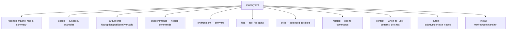

# Project Schema — Summary

> **No persistence layer** — no DB/SQL schema. mallm is a stateless CLI; the schema
> below is the `mallm.yaml` documentation-file format (JSON Schema draft 2020-12 at
> `schemas/mallm.schema.json`, version `"1.0"`).

## Quick reference

| Artifact | Location | Notes |
|----------|----------|-------|
| mallm.yaml (project) | `<git-root>/.mallm/<app>.yaml` | Tier-1 lookup |
| mallm.yaml (user) | `~/.config/mallm/<app>/mallm.yaml` | Tier-2 lookup |
| Native protocol | `<app> --mallm` stdout (YAML) | Tier-3 |
| Help fallback | parsed `<app> --help` | Tier-4 |
| JSON Schema | `schemas/mallm.schema.json` | Authoritative contract |
| Cache/state/secret files | none | Stateless; reads no env vars |

| CLI command | Flags |
|-------------|-------|
| `mallm [app]` / `show <app>` | `--json`, `--version <ver>` |
| `init <app>` | `--global` |
| `list` | `--json` |
| `validate <path>` | exits 1 on failure |
| `schema` | prints JSON Schema |

`--json` output adds a runtime `_meta` object (source, timestamp) not in the schema.
