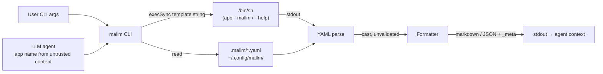

# Threat Model

## Overview

`mallm` is a stateless local CLI: it reads YAML files, shells out to the tool being documented, and prints Markdown/JSON to stdout. There is no network listener, no persistence layer, and no credentials. The dominant trust boundary is **not** a network perimeter — it is the path from *data* to *execution*: the `app` argument and YAML content flow into `execSync` shell strings and into output consumed by LLM agents.

Assets at stake: the invoking user's shell (via command execution), and the correctness of context fed to LLM agents (via rendered documentation).

Grounding: components and resolution chain per [PROJ-ARCH.md](PROJ-ARCH.md); file locations per [PROJ-LAYOUT.md](PROJ-LAYOUT.md).

## Attack Surface

Trust boundaries crossed: (1) untrusted-content-derived `app` name → shell execution; (2) arbitrary YAML (project files, native-tier stdout) → agent-consumed output.

## Vulnerability Register

| ID | Severity | STRIDE | Component | Status |
|----|----------|--------|-----------|--------|
| T-001 | High | Tampering / EoP | `resolver.ts` (`tryNative`, `tryHelpFallback`), `init.ts` | **Open** — `app` interpolated into `execSync` template strings (`${app} --mallm`, `${app} --help 2>&1 || …`) with no sanitization; shell metacharacters execute. Direct human use is self-inflicted, but an LLM agent passing an app name derived from untrusted content (prompt injection) crosses a real boundary. |
| T-002 | Medium | Tampering | `resolver.ts` `loadYaml` / `tryNative` | **Open** — parsed YAML is cast `as MallmConfig` with zero structural validation at read time; `mallm validate` exists but the resolver never calls it. Malformed/hostile definitions flow verbatim into agent-consumed output (documentation injection → confused deputy). |
| T-003 | Low | DoS | `resolver.ts`, `init.ts` | **Partial** — `yaml@2` defaults cap alias expansion (`maxAliasCount` 100) and exec calls carry a 5 s timeout with piped stdio; deeply nested YAML can still cost parse time. Accepted for a local tool. |
| T-004 | Low | Info disclosure | `formatter.ts`, `help-parser.ts` | **Accepted** — `_meta` exposes local filesystem paths; help fallback merges stderr (`2>&1`), so target-tool diagnostics (potentially sensitive) land in output. Local-trust context; informational. |
| T-005 | Low | Tampering | `init.ts` | **Open** — `app` is joined into output paths (`join(root, ".mallm", `${app}.yaml`)`, `join(homedir(), …, app)`) without traversal checks; `../`-laden names write outside the intended dirs. Same-user trust limits impact. |
| T-006 | Low | Supply chain | `package.json` | **Accepted** — small dependency set (`commander`, `yaml`, `chalk`), pinned lockfile, published from the org registry. Standard npm scrutiny. |

## Mitigation Coverage

0 mitigated · 2 partial/accepted · 3 open. No external tickets; open items below.

Recommended remediations (map to IDs):

- **T-001**: replace `execSync` template strings with `execFileSync(app, ["--mallm"])` (argv array, no shell), or reject `app` names outside `[A-Za-z0-9._-]+`. This also fixes the `-h` fallback — probe flags separately rather than via `|| true` shell chains.
- **T-002 / T-005**: run the existing JSON Schema (`schemas/mallm.schema.json`) or `validate` logic on every load; validate `app` as a single path segment before any `join`.

## Residual Risk

mallm's threat model assumes the invoking principal trusts their own filesystem and PATH — standard for a dev CLI. The deliberately accepted residual is agent-mediated injection (T-001): until argv-array execution lands, treat `mallm show <app>` with agent-sourced `app` names as shell-equivalent. No secrets are read, stored, or emitted; revocation/response needs are nil beyond removing a definition file.
